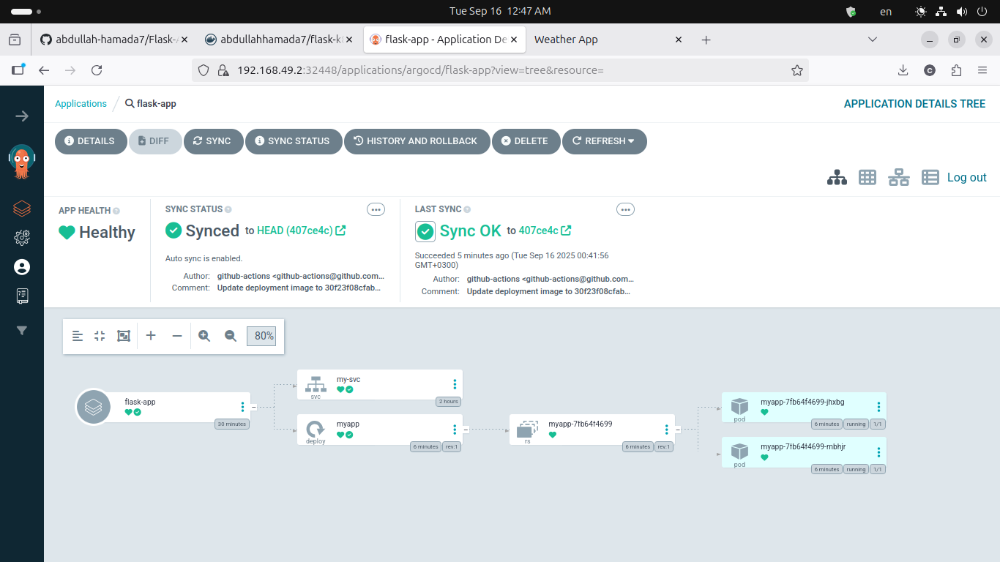
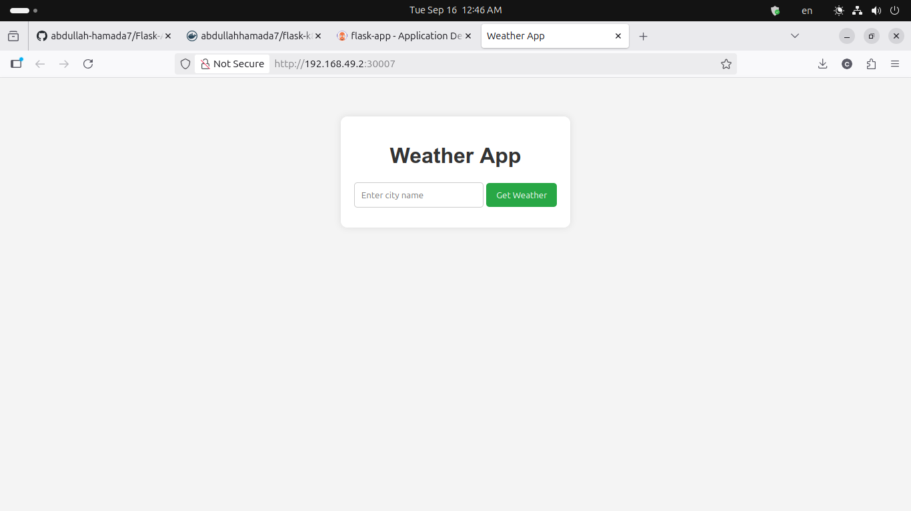

[](https://github.com/abdullah-hamada7/Flask-App-GitHub-Actions-ArgoCD/actions/workflows/main.yml)


# Complete CI/CD DevOps Project
### Deploy Python Flask App on Kubernetes cluster with GitOps Approach. 


---
### Workflow:
Whenever Developer writing/changes a code and push into main branch, GitHub Pipeline will triggered and it will test the code with Flake8 and containerized the application with new tag and push into artifacts(dockerhub) and also GitHub Actions pipeline will update Kubernetes Manifests file with new image tag then ArgoCD will look for new changes in Manifests file and will rollout new application in kubernetes. 
```
│   app.py
│   README.md
│   requirements.txt
│
├───k8s
│       deploy.yml
│       svc.yml
│
├───static
│       style.css
│
└───templates
        index.html
```
## Test Application Locally. 
Whenever we are creating pipeline, it is best practice to test application locally.
- Application prequisities. 
  - Python 3.9 
  - pip installed

- Clone/Fork the Repo. 
    ```
    git clone https://github.com/abdullah-hamada7/Flask-App-GitHub-Actions-ArgoCD.git
    cd Flask-App-GitHub-Actions-ArgoCD
    ```
- Install Dependence
    ```
    pip install -r requirements.txt
    ```
- Run locally. 
    ```
    python app.py
    ```
- Access the application.
    ```
    http://localhost:5000
    ```

Note: This application is running on 5000 port, but if you want to change, you can change the port in app.py script.

---
#### Lets Build and Run the Container
1. Build the Image: Run the following in the directory containing your Dockerfile:
```
docker build -t abdullahhamada7/flask-k8s .
```
Note: you need to change the name of your image, according to your dockerhub username.

2. Lets create container with image.
 ```
 docker run -d -p 5000:5000 --name=flask-app abdullahhamada7/flask-k8s
 ```

 - If everything is working fine and you are able to access application with https://localhost:5000 then next step is to write a GitHub Pipeline.


- Make sure setup your docker Personal Access token into github repo. 

## Setup ArgoCD in Minikube

Note: You can setup Argo CD in any cluster, instructions are same. 

- First install Minikube:
    Installation guide for installing Minikube. 
    [Minikube.sigs.k8s.io](https://minikube.sigs.k8s.io/docs/start/?arch=%2Fwindows%2Fx86-64%2Fstable%2F.exe+download)

---
- Install Argo CD
    ```
    kubectl create namespace argocd
    kubectl apply -n argocd -f https://raw.githubusercontent.com/argoproj/argo-cd/stable/manifests/install.yaml 
    ```

- Verify if ArgoCD is running:
    ```
    kubectl get all -n argocd
    ```

---
- Access ArgoCD With configuring NodePort 
    ```
    kubectl patch svc argocd-server -n argocd -p '{"spec": {"type": "NodePort"}}'
    ```
- Verify if ArgoCD server running as NodePort.
   ```
   kubectl get svc -n argocd
   ```                  
- Grab ArgoCD secret for accessing UI
   ```
   kubectl get secrets -n argocd argocd-initial-admin-secret -o jsonpath='{.data.password}' | base64 -d
   ```
- Start Minkube Service. 
   ```
    minikube service argocd-server -n argocd
    ```
   - Username: admin
   password: secret(please check above command)

---
### Setup our Continous deployment. 

1. Select New App.
---
2. Syncing your manifests files:
---

Successfully Deployed our app:


---
Access Application with below command.
```
minikube service list
```

